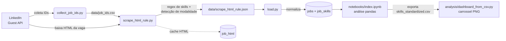

# LinkedIn Job Analysis — Mercado de Vagas de Dados no Brasil

Pipeline **ETL** que coleta vagas da área de dados publicadas no LinkedIn (Brasil),
extrai automaticamente as **skills** e a **modalidade de trabalho** (presencial / remoto /
híbrido) de cada vaga e organiza tudo num **modelo relacional** pronto para análise.

O resultado é uma base que permite responder perguntas como: *quais as skills mais pedidas
para Engenheiro de Dados?*, *qual a fatia de vagas remotas?*, *quais ferramentas dominam o
mercado de BI?* — explorada num notebook de análise com pandas.

> 📚 **Projeto de portfólio / educacional.** O foco é demonstrar arquitetura de pipeline de
> dados, web scraping responsável, modelagem relacional e orquestração. Veja as
> [Considerações e limitações](#-considerações-e-limitações).

---

## 📑 Sumário

- [Stack](#-stack)
- [Visão geral da arquitetura](#-visão-geral-da-arquitetura)
- [Estrutura de diretórios](#-estrutura-de-diretórios)
- [Como funciona cada etapa](#-como-funciona-cada-etapa)
- [Modelo de dados](#-modelo-de-dados)
- [Pré-requisitos](#-pré-requisitos)
- [Instalação](#-instalação)
- [Configuração (`.env`)](#-configuração-env)
- [Como executar](#-como-executar)
- [Análise e Visualização](#-análise-e-visualização)
- [Considerações e limitações](#-considerações-e-limitações)

---

## 🧰 Stack

| Camada | Tecnologia |
| --- | --- |
| Linguagem | Python 3.11 |
| Scraping / parsing | `urllib` (HTTP) + `BeautifulSoup4` + `re` (regex) |
| Armazenamento | CSV/JSON (local) **ou** PostgreSQL (`psycopg2`) |
| Orquestração | Apache Airflow (DAG `@daily`) via Docker Compose |
| Análise e Visualização | Jupyter + pandas + matplotlib + unidecode |

---

## 🏗 Visão geral da arquitetura

O pipeline tem **três etapas** encadeadas, no padrão Extract → Transform → Load:



1. **Extract — coleta de IDs**: descobre os identificadores das vagas.
2. **Extract + Transform — scrape e extração**: baixa o HTML de cada vaga e extrai os campos
   estruturados (cargo, empresa, cidade, modalidade, skills).
3. **Load**: normaliza em tabelas relacionais e persiste (CSV local ou PostgreSQL).

Há **dois modos de orquestração**:

- **Sequencial simples**: [`run_pipeline.py`](run_pipeline.py) roda as 3 etapas em ordem.
- **Airflow**: [`dags/pipeline.py`](dags/pipeline.py) define a DAG `linkedin_jobs_pipeline`
  (agendada `@daily`), executada pela stack do [`docker-compose.yaml`](docker-compose.yaml).

---

## 📂 Estrutura de diretórios

```
linkedin-job-analysis/
├── run_pipeline.py              # Roda o pipeline inteiro em sequência (sem Airflow)
├── requirements.txt             # Dependências Python
├── docker-compose.yaml          # Stack do Airflow (postgres, redis, scheduler, worker...)
├── .env                         # Variáveis de ambiente (NÃO versionar — use .env.example)
│
├── common/                      # Camada compartilhada entre as etapas
│   ├── config.py                #   Carrega .env, expõe paths e toggles (backend, delays)
│   ├── storage.py               #   Persistência da etapa load (local CSV ou Postgres)
│   ├── db.py                    #   Acesso ao PostgreSQL (schema + upsert idempotente)
│   └── html_store.py            #   Cache do HTML bruto das vagas (reprocessar sem rebaixar)
│
├── extract/                     # Etapas de extração
│   ├── linkedin_jobs/
│   │   └── collect_job_ids.py   #   (1) Coleta os job_ids paginando a busca do LinkedIn
│   └── scrape_html_rule/
│       ├── scrape_html_rule.py  #   (2) Baixa o HTML + extrai skills/modalidade via regex
│       └── skills_dict.py       #   Dicionário de ~255 skills canônicas e seus aliases
│
├── load/
│   └── load.py                  # (3) Normaliza o JSON em jobs + job_skills e persiste
│
├── sql/
│   └── schema.sql               # DDL das tabelas (job_html, jobs, job_skills) — idempotente
│
├── dags/
│   └── pipeline.py              # DAG do Airflow encadeando as 3 etapas
│
├── notebooks/
│   └── index.ipynb              # Análise exploratória (skills, cargos, níveis) com pandas
│
├── analysis/
│   ├── dashboard_from_csv.py    # Gera o carrossel de imagens (PNG) a partir do CSV do notebook
│   └── post_copy.md             # Sugestão de texto e copy para o post
│
├── output/
│   └── carousel/                # Imagens geradas pelo dashboard (PNG)
│
└── data/                        # Saídas do pipeline (geradas em runtime)
    ├── job_ids.csv              #   IDs coletados na etapa 1
    ├── job_html.csv             #   Cache do HTML bruto (modo local)
    ├── scrape_html_rule.json    #   Vagas extraídas (saída da etapa 2)
    ├── jobs.csv                 #   Tabela jobs (modo local)
    ├── job_skills.csv           #   Tabela job_skills (modo local)
    └── skills_standardized.csv  #   Export do notebook p/ o dashboard (vaga × skill enriquecida)
```

---

## ⚙️ Como funciona cada etapa

### 1. Coleta de IDs — `extract/linkedin_jobs/collect_job_ids.py`

Pagina a **API "guest"** de busca de vagas do LinkedIn (endpoint público, sem login) e
extrai os identificadores das vagas.

- A URL de busca é definida no topo do script (`SEARCH_URL`) — por exemplo
  `cientista-de-dados-vagas`, `engenheiro-de-dados-vagas`, `analista-de-dados-vagas`.
  Cada "página" avança 10 resultados (`start=0, 10, 20, ...`).
- Os IDs são capturados por regex sobre o HTML retornado:
  `data-entity-urn="urn:li:jobPosting:(\d+)"`.
- **Idempotente**: relê o `data/job_ids.csv` existente e ignora IDs já salvos; grava de
  forma incremental (o progresso sobrevive a interrupções).
- **Anti-rate-limit**: aplica um *delay aleatório* entre páginas (`REQUEST_DELAY_MIN`–`MAX`)
  e respeita o teto de páginas `MAX_PAGINATION_STEPS`.

**Saída:** `data/job_ids.csv` (colunas `job_id`, `url`).

### 2. Scrape + extração de skills — `extract/scrape_html_rule/scrape_html_rule.py`

Para cada `job_id` ainda não processado, baixa o HTML da página de detalhe da vaga, faz o
parse com **BeautifulSoup** e extrai os campos estruturados.

- **Parsing** (`parse_job_meta` / `parse_markup_text`): cargo (`title`), empresa
  (`company`), cidade (`city`) e o texto da descrição da vaga.
- **Motor de regex de skills** (`extract_skills`): identifica as tecnologias citadas na
  descrição usando o dicionário [`skills_dict.py`](extract/scrape_html_rule/skills_dict.py)
  (~255 conceitos canônicos agrupados por categoria — linguagens, bibliotecas, cloud,
  bancos, BI, orquestração, ML/IA, soft skills, idiomas...). Características:
  - **Normalização**: remove acentos, baixa caixa e colapsa espaços, para o casamento ser estável.
  - **Tolerância de grafia**: `data integration` casa também `dataintegration` e `data-integration`.
  - **Longest-match**: monta um único regex com todos os aliases ordenados do mais longo
    para o mais curto, então `spark sql` vence o `spark` contido nele (sem contagem dupla).
  - Cada skill canônica entra **no máximo uma vez** por vaga.
- **Detecção de modalidade** (`detect_modalidade`): a partir de cargo/cidade/descrição,
  classifica em `presencial`, `remoto` ou `hibrido` (palavra explícita de híbrido vence; se
  houver sinais de remoto **e** presencial juntos, classifica como híbrido).
- **Cache de HTML** ([`common/html_store.py`](common/html_store.py)): o HTML bruto é salvo
  (em `data/job_html.csv` ou na tabela `job_html`) para permitir **reprocessar offline**,
  sem refazer as requisições. Controlado pela flag `--source`:
  - `--source request` (padrão): baixa o HTML do LinkedIn, reusando o cache quando a vaga já
    foi baixada antes; salva o HTML novo no cache.
  - `--source cache`: reprocessa **apenas** a partir do HTML já salvo, sem nenhuma requisição
    de rede (útil ao ajustar o dicionário de skills e querer reaplicá-lo sobre tudo).
- **Idempotente**: vagas já presentes no `scrape_html_rule.json` são puladas; o JSON é salvo
  a cada vaga (seguro contra `Ctrl-C`).

**Saída:** `data/scrape_html_rule.json` — lista de objetos
`{ job_id, title, company, city, work_mode, skills: [...] }`.

### 3. Load — `load/load.py`

Lê o JSON, **normaliza** em duas relações e persiste.

- `normalize()` separa cada entrada em:
  - **jobs_rows**: `{job_id, title, company, city, work_mode}` (uma linha por vaga).
  - **skills_rows**: `(job_id, skill)` (uma linha por skill da vaga).
- A persistência é despachada por [`common/storage.py`](common/storage.py) conforme a
  variável `STORAGE_BACKEND`:
  - `local` → grava `data/jobs.csv` e `data/job_skills.csv`.
  - `database` → faz **upsert idempotente** no PostgreSQL (cria o schema se preciso via
    [`sql/schema.sql`](sql/schema.sql); atualiza vagas por `job_id` e substitui as skills).

---

## 🗄 Modelo de dados

Definido em [`sql/schema.sql`](sql/schema.sql). No modo `database` são tabelas Postgres; no
modo `local` os CSVs `jobs.csv` / `job_skills.csv` espelham `jobs` / `job_skills`.

| Tabela | Descrição | Colunas principais |
| --- | --- | --- |
| `job_html` | Cache do HTML bruto da vaga (fonte para reprocessamento offline) | `job_id` (PK), `html_text`, `fetched_at` |
| `jobs` | Uma linha por vaga | `job_id` (PK), `title`, `company`, `city`, `work_mode`, `created_at` |
| `job_skills` | Uma linha por skill de cada vaga | `job_id` (FK → jobs), `skill`, PK (`job_id`, `skill`) |

- `work_mode` tem um `CHECK` que aceita apenas `presencial`, `remoto`, `hibrido` ou `NULL`.
- `job_skills.job_id` referencia `jobs` com `ON DELETE CASCADE`.
- Índices em `job_skills(skill)` e `jobs(work_mode)` para acelerar as agregações da análise.

```
jobs (1) ───< (N) job_skills
job_html  (cache independente, chaveado por job_id)
```

---

## 📤 Exemplos de saída

### `data/job_ids.csv` — etapa 1 (coleta de IDs)

```csv
job_id,url
4419256409,https://br.linkedin.com/jobs-guest/jobs/api/seeMoreJobPostings/engenheiro-de-dados-vagas?start=0
4409624796,https://br.linkedin.com/jobs-guest/jobs/api/seeMoreJobPostings/engenheiro-de-dados-vagas?start=0
```

### `data/scrape_html_rule.json` — etapa 2 (scrape + extração)

Lista de objetos, um por vaga (lista de skills encurtada no exemplo):

```json
[
  {
    "job_id": "4419256409",
    "title": "ANALISTA DE DADOS PL",
    "company": "Cacau Show",
    "city": "São Paulo, SP",
    "work_mode": null,
    "skills": [
      "Azure",
      "Azure Data Factory",
      "Databricks",
      "ETL",
      "Power BI",
      "PySpark",
      "Python",
      "SQL"
    ]
  }
]
```

### `data/jobs.csv` — etapa 3, modo `local`

Uma linha por vaga (espelha a tabela `jobs`):

```csv
job_id,title,company,city,work_mode
4419256409,ANALISTA DE DADOS PL,Cacau Show,"São Paulo, SP",
4409624796,Engenheiro de Dados,Empresa Exemplo,"Rio de Janeiro, RJ",remoto
```

> O campo `work_mode` fica vazio quando a modalidade não pôde ser detectada (corresponde a `NULL` no banco).

### `data/job_skills.csv` — etapa 3, modo `local`

Uma linha por par vaga × skill (espelha a tabela `job_skills`):

```csv
job_id,skill
4419256409,Azure
4419256409,Databricks
4419256409,Power BI
4419256409,Python
4419256409,SQL
4409624796,Apache Airflow
4409624796,Python
4409624796,Spark
```

---

## ✅ Pré-requisitos

- **Python 3.11**
- **Docker + Docker Compose** *(opcional)* — necessário apenas para usar o PostgreSQL como
  backend ou rodar o pipeline via Airflow.

---

## 📥 Instalação

```bash
# 1. Clone o repositório
git clone <url-do-repo>
cd linkedin-job-analysis

# 2. Crie e ative um ambiente virtual
python3.11 -m venv venv
source venv/bin/activate          # Windows: venv\Scripts\activate

# 3. Instale as dependências
pip install -r requirements.txt
```

> ℹ️ Este `venv` cobre **o pipeline**. A parte de análise e visualização usa ainda
> `matplotlib`, `unidecode` e `jupyter` (já que `pandas` está no `requirements.txt`).
> Instale-os à parte para explorar: `pip install matplotlib unidecode jupyter`.

> 🛠 **Solução de problemas — venv movido/renomeado.** Se você mover ou renomear a pasta do
> projeto, os *wrappers* do venv (`venv/bin/pip`, `jupyter`, etc.) quebram, pois o shebang
> deles aponta para o caminho **antigo** (erro `bad interpreter: .../python: no such file`).
> O binário `venv/bin/python` continua funcionando. Soluções:
> - usar `python -m pip ...` em vez de `pip ...`; ou
> - **recriar o venv** (recomendado):
>   ```bash
>   rm -rf venv
>   python3 -m venv venv
>   ./venv/bin/python -m pip install -r requirements.txt
>   ```

---

## 🔧 Configuração (`.env`)

A configuração é centralizada em [`common/config.py`](common/config.py), que carrega um
arquivo `.env` na raiz. **Variáveis passadas no shell têm precedência sobre o `.env`**
(ex.: `STORAGE_BACKEND=database python load/load.py`).

Crie um `.env` (recomendado versionar apenas um `.env.example` com placeholders):

```dotenv
# Coleta
MAX_PAGINATION_STEPS=100     # nº de páginas da busca a percorrer (cada uma = 10 vagas)
REQUEST_DELAY_MIN=1          # delay mínimo (s) entre requisições
REQUEST_DELAY_MAX=5          # delay máximo (s) entre requisições

# Backend de armazenamento da etapa load: local | database
STORAGE_BACKEND=local

# PostgreSQL (use os mesmos valores do docker-compose)
# No host: DB_HOST=localhost (porta 5432 exposta). Dentro do Airflow: DB_HOST=postgres.
DB_HOST=localhost
DB_PORT=5432
DB_NAME=airflow
DB_USER=airflow
DB_PASSWORD=airflow

# Airflow (apenas para a stack Docker)
AIRFLOW_UID=1000
FERNET_KEY=<gerar-uma-chave-fernet>
```

| Variável | Default | Para que serve |
| --- | --- | --- |
| `MAX_PAGINATION_STEPS` | `1` | Quantas páginas da busca coletar (etapa 1) |
| `REQUEST_DELAY_MIN` / `MAX` | `5` / `15` | Faixa do delay aleatório entre requisições |
| `STORAGE_BACKEND` | `local` | `local` (CSV/JSON) ou `database` (PostgreSQL) |
| `DB_HOST` / `DB_PORT` / `DB_NAME` / `DB_USER` / `DB_PASSWORD` | credenciais `airflow` | Conexão ao Postgres |
| `AIRFLOW_UID` / `FERNET_KEY` | — | Configuração da stack do Airflow |

> 🔐 **Segurança:** nunca faça commit de credenciais reais no `.env`. Mantenha-o no
> `.gitignore` (já está) e compartilhe apenas um `.env.example` com placeholders.

---

## ▶️ Como executar

### Pipeline completo (modo local, sem Docker)

Roda as três etapas em sequência e grava os resultados em `data/`:

```bash
python run_pipeline.py
```

### Etapas individuais

```bash
# 1. Coletar os IDs das vagas
python extract/linkedin_jobs/collect_job_ids.py

# 2. Baixar o HTML e extrair skills/modalidade
python extract/scrape_html_rule/scrape_html_rule.py                 # baixa (reusa cache)
python extract/scrape_html_rule/scrape_html_rule.py --source cache  # só reprocessa o cache

# 3. Normalizar e carregar
python load/load.py
```

### Usando PostgreSQL como backend

Suba o banco (a stack do compose já inclui um Postgres) e aponte o backend para `database`:

```bash
docker compose up -d postgres          # sobe só o Postgres (porta 5432)
STORAGE_BACKEND=database python load/load.py
```

O schema é criado automaticamente na primeira execução (`common/db.py` aplica `sql/schema.sql`).

#### Migrar para o banco dados já coletados localmente

Se você já rodou o pipeline em modo `local` e quer subir os arquivos existentes para o
Postgres de uma vez, use [`load/load_to_database.py`](load/load_to_database.py). Diferente
do `load.py`, este script **sempre** escreve no banco (ignora `STORAGE_BACKEND`) e importa:

- `data/job_html.csv` → tabela `job_html` (o cache de HTML, que o `load.py` não toca);
- `data/scrape_html_rule.json` → tabelas `jobs` + `job_skills`.

```bash
docker compose up -d postgres          # garanta o Postgres no ar
python load/load_to_database.py
```

É **idempotente** (usa `upsert`/`ON CONFLICT`), então pode ser executado várias vezes sem
duplicar registros.

### Via Airflow (orquestração agendada)

```bash
docker compose up -d                   # sobe a stack completa do Airflow
```

Acesse a UI do Airflow (por padrão `http://localhost:8080`, usuário/senha `airflow`/`airflow`),
ative a DAG **`linkedin_jobs_pipeline`** e dispare-a — ela executa as três etapas em ordem
(`collect_job_ids` → `scrape_skills` → `load_dataset`), agendada `@daily`.

---

## 📊 Análise e Visualização

### Exploratória (Notebook)

Abra [`notebooks/index.ipynb`](notebooks/index.ipynb) com Jupyter:

```bash
jupyter notebook notebooks/index.ipynb
```

A análise carrega o `data/scrape_html_rule.json` com pandas e faz, entre outras coisas:

- **explode** das skills (uma linha por par vaga × skill);
- **normalização de cargos** em grupos (`Data Engineer`, `Data Analyst`, `BI Analyst`,
  `Data Scientist`, `Analytics Engineer`, `Data Architect`, `Data Leadership`, `Data Intern`...);
- **padronização de nomes de skills** (unifica variações como `powerbi`/`power bi` → `Power BI`);
- **classificação de senioridade** (`level`) a partir do título da vaga e marcação do tipo
  de skill (`tipo_skill`);
- **rankings** das skills e dos cargos mais frequentes;
- **export de `data/skills_standardized.csv`** — uma linha por par vaga × skill, enriquecida
  com `position_group`, `level`, `skill_grouped` e `tipo_skill` — consumido pelo dashboard.

### Dashboard LinkedIn (Carrossel)

[`analysis/dashboard_from_csv.py`](analysis/dashboard_from_csv.py) gera um carrossel de
imagens (PNG, 1080×1350 px) para publicação no LinkedIn, com a narrativa
**"Skills × Senioridade"** — como o conjunto de skills mais pedidas muda de júnior para
sênior. Lê o `data/skills_standardized.csv` exportado pelo notebook.

```bash
python analysis/dashboard_from_csv.py            # gera os PNGs em output/carousel/
python analysis/dashboard_from_csv.py --validate # apenas inspeciona os números no terminal
```

São **9 slides**, em ordem (`01` → `09`): capa, a amostra, perfil das vagas sem
senioridade, top 10 de skills (júnior, pleno e sênior), o núcleo (skills presentes em
todos os níveis), a virada (o que diferencia o sênior) e a conclusão.

**Metodologia aplicada na leitura dos dados:**

- foca em carreira de dados — exclui os grupos `Not Data Role` e `Data Talent Pool`;
- vagas que anunciam uma **faixa** de senioridade (ex.: "Pleno/Sênior") ficam fora da
  comparação por nível, para que as contagens por senioridade somem corretamente;
- o percentual de vagas **sem senioridade declarada** é calculado a partir dos dados (não
  é fixo), mantendo os slides sempre consistentes com a amostra atual.

Veja o arquivo [`analysis/post_copy.md`](analysis/post_copy.md) para a sugestão de legenda e detalhes sobre os slides gerados.

---

## ⚠️ Considerações e limitações

- **Uso educacional.** O scraping atinge endpoints públicos do LinkedIn; respeite os Termos
  de Uso da plataforma. O projeto aplica delays aleatórios para não sobrecarregar o serviço.
